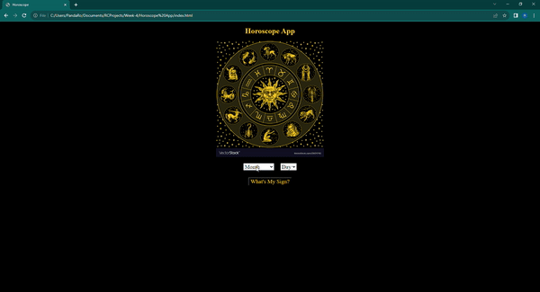

# Golden-Horoscope

A horoscope web application that gives you a horoscope and tell you your sign based on the birth date you select from the dropdown boxes.

Link to project: https://golden-horoscope.netlify.app/

## How It's Made:

Tech used: HTML, CSS, JavaScript

I used html to create two forms with two select elements. I made option values for the first one the twelve months of the year with matching values. Then I made the options of the second select element, the numbers 1-31 with matching values to represent the days of each month. Lastly, I created containers to hold the result of your sign and your horoscope from the function. 

With the Javascript, I created two variables to hold the two select elements. I created a smurf to run an event listener that runs the checkHoroscope() function that determines your horoscope based on the values the user selects for month and day. In the function, I used the if statement with else if statements that all checked the values of month selected by the user and the value of the months from January-Decemeber. Then it checks the day  values as well. Depending on the combination that the user enters, it choses your sign and horoscope based on the where in the conditional the values run as true. Then the function returns the results. 

I used CSS to center the elements and change the colors and font-sizes of the elements.

## Optimizations

I noticed that when the user just entered a Month value and no Day value, or vice versa, the function would still return a horoscope. To get this to stop, I added a new value to each select elements. I made the values "Month" and "Day". Then I added to the function to check for those values and return that the date was not entered instead of a horoscope.

## Lessons Learned:

In this project, I learned how to use the logical operators to check multiple conditions against each other. I really had fun figure out the logic of this project.